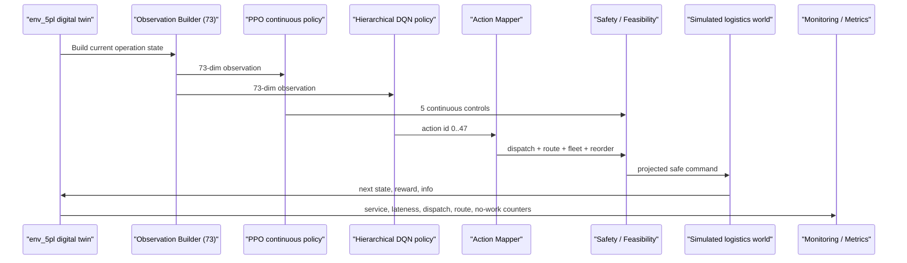
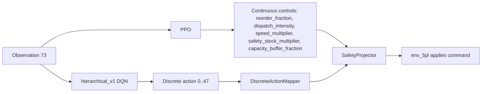
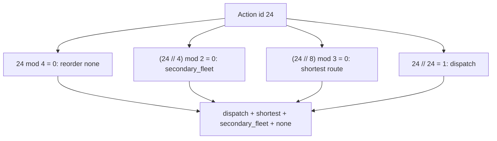
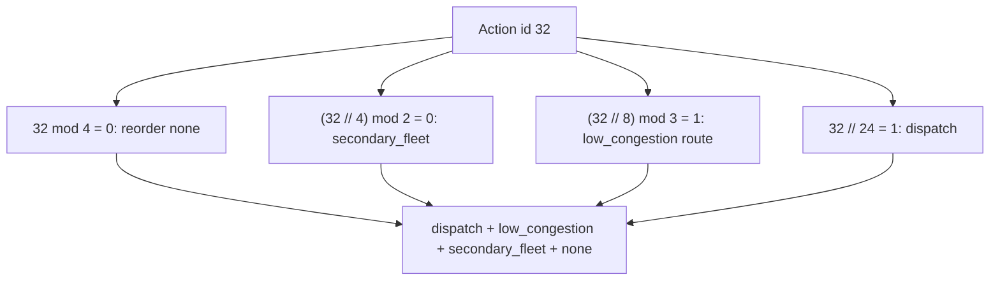
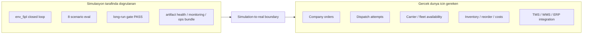
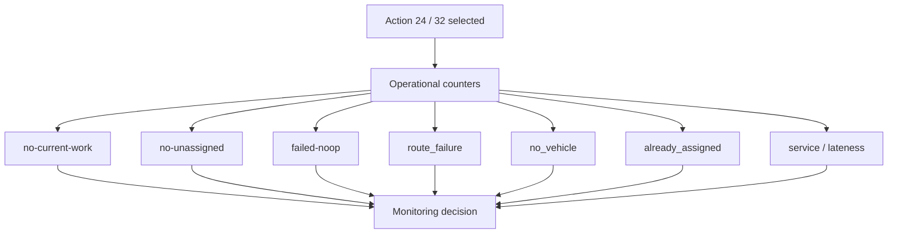

# Tez Danismani Operasyon Walkthrough Diyagram Notlari

Tarih: 2026-06-12

Bu dosya, sunum veya rapor icin kullanilabilecek diyagram notlarini icerir. Diyagramlar gercek step trace degil, kodla uyumlu operasyon akisini gosterir.

## 1. One-Operation Sequence

## 2. PPO ve DQN Ayrimi

Ana mesaj:

- PPO ince ayar kollari gibi calisir.
- DQN ana taktik operasyon karari verir.
- Joint modda PPO dispatch icin makro release/budget etkisi verir, fakat dogrudan dispatch'i DQN yapar.

## 3. Action 24 Decode Diyagrami

Sunum cumlesi:

> Action 24 tek bir sayi gibi gorunur, fakat aslinda dort parcali bir lojistik komuttur: dispatch yap, shortest route kullan, secondary fleet kullan, reorder override yapma.

## 4. Action 32 Decode Diyagrami

Sunum cumlesi:

> Action 32 route disruption altinda daha dusuk congestion maliyeti olan rota ailesini tercih eden dispatch kararidir.

## 5. Simulator ve Gercek Dunya Siniri / Real-world Boundary

Ana mesaj:

- Proje simule digital twin icinde otonomdur.
- Gercek dunyada full autonomous claim icin sirket verisi ve entegrasyon gerekir.

## 6. Monitoring Watch Diyagrami

Ana mesaj:

> Action concentration tek basina hata degildir. Hata olup olmadigini service, lateness ve no-work/failure counter'lariyla birlikte okuyoruz.
